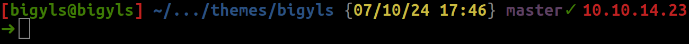

# Bigyls-bash-theme
[](https://github.com/Bigyls/Bigyls-bash-theme)

Personal bash theme  that use [Oh My Bash](https://github.com/ohmybash/oh-my-bash).



## Install

```shell
git clone https://github.com/Bigyls/Bigyls-bash-theme.git
cd Bigyls-bash-theme
sudo chmod +x install.sh
./install.sh
```
